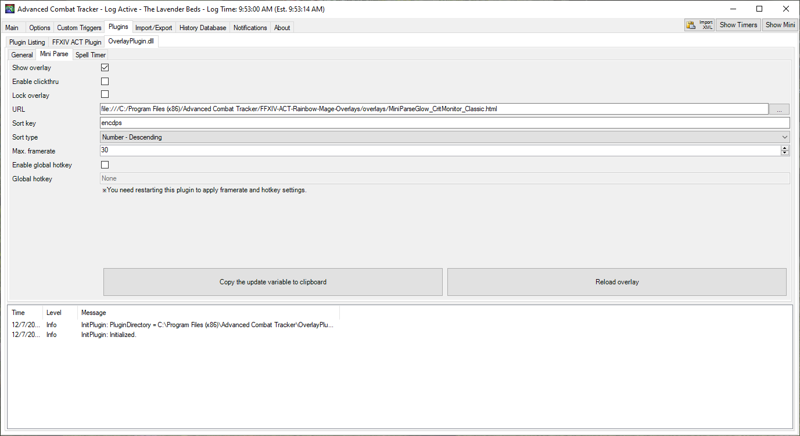
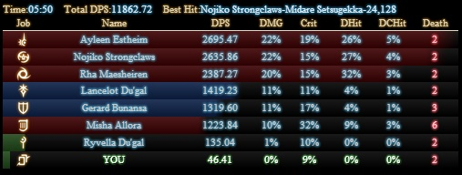

# ACT FFXIV Plugin Overlays

 

Requires FFXIV [Overlay Plugin](https://github.com/RainbowMage/OverlayPlugin) to function.

 

## How-To:

 

To use this overlay, do the following:
1. Download and configure [ACT](https://advancedcombattracker.com/download.php)
2. Download and configure the [FFXIV Overlay Plugin](https://github.com/RainbowMage/OverlayPlugin/blob/master/README-en.md)
   * You may need to 'unblock' the included DLL files. You can do this by right clicking on them, going to properties, and then checking 'unblock' at the bottom of the dialog window
3. Download the latest release of this overlay (click 'releases' above and download the latest version)
4. Extract the 'FFXIV-ACT-Rainbow-Mage-Overlays' zip into your ACT installation directory
5. Open ACT, select the 'Plugins' tab, then the 'OverlayPlugin.dll' tab, then the 'Mini Parse' tab
6. Configure the URL field to point to the MiniParseGlow_CritMonitor_4.05.html file within the 'FFXIV-ACT-Rainbow-Mage-Overlays' folder as follows:

 

 

## Overlay Preview:
 

 

## Contributing:

 

PRs are open, in order to add new classes and icons do the following:

 

1. Add the new class icons to the various images folders. 
   * Icons should be 32x32.
   * [Gamerscape](https://ffxiv.gamerescape.com/wiki/Dictionary_of_Icons) is often a good source.
2. Update **MiniParseGlow_CritMonitor_4.05.html** with the class abbrevations.
   * Search for **!EXPANSION UPDATE ME!** to locate the two lists to update.

