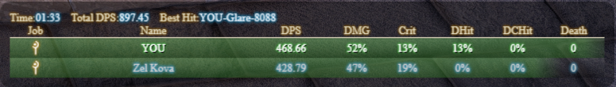
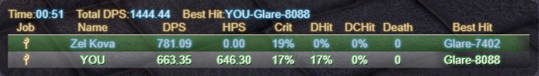
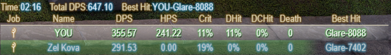
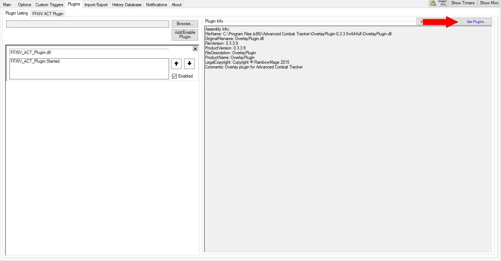
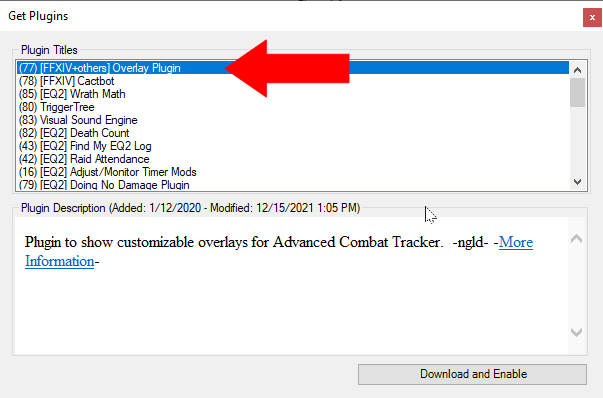
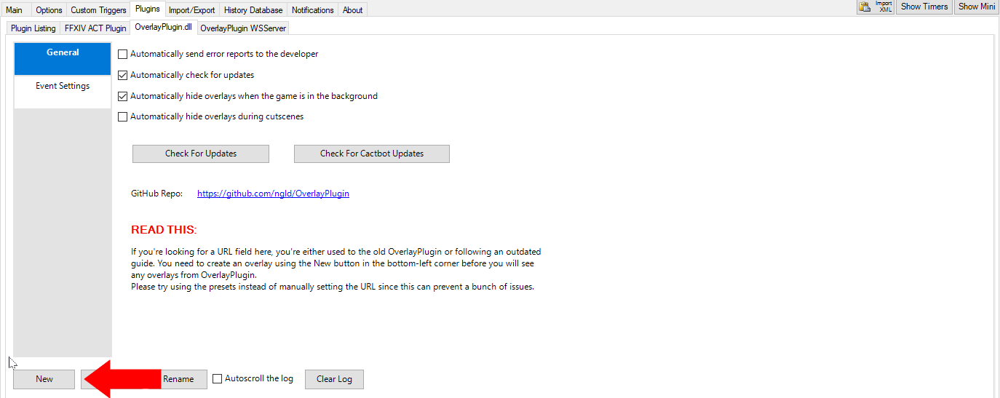
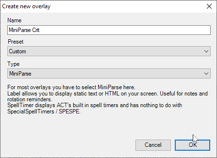
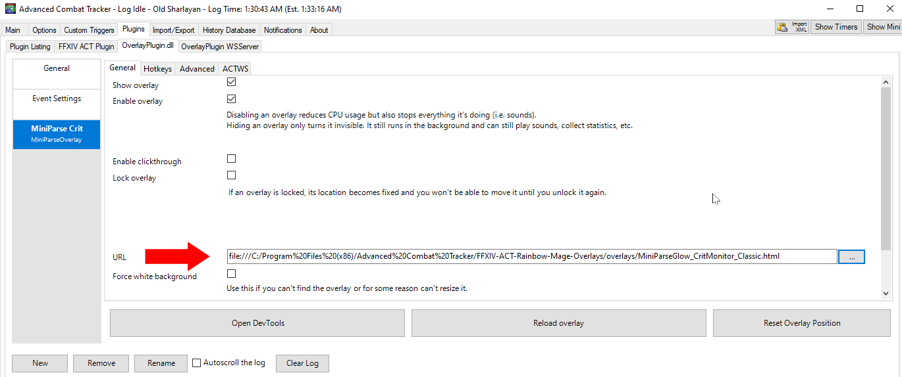

# ACT FFXIV Plugin Overlays

  
## About
These are light-weight overlays meant to be used in conjunction with [Advanced Combat Tracker](https://advancedcombattracker.com/download.php) and the FFXIV Parsing Plugin.

## Navigation
  - [About](#about)
  - [Overlay Previews](#overlay-previews)
  - [Setup](#setup)
  - [Contributing](#contributing)

 

## Overlay Previews

Mini Parse Glow Classic

Mini Parse Glow Classic BG

Created by @Vrandus

Mini Parse Glow HPS MaxHit Highlighted You BG

Created by @Vrandus

Mini Parse Glow HPS MaxHit Highlighted You

Created by @Vrandus

 

## Setup

 

To use this overlay, do the following:
1. Download and configure [Advanced Combat Tracker](https://advancedcombattracker.com/download.php)
2. Select FFXIV parsing plugin after installation.
3. Download the latest release of this overlay (click 'releases' above and download the latest version).
4. Extract the 'FFXIV-ACT-Rainbow-Mage-Overlays' zip into your ACT installation directory.
5. Install the OverlayPlugin.
    * Goto the **Plugins** tab and click the **Get Plugins...** button.
    
     
    
      
    
    * Select the **OverlayPlugin** option.
    
     
    
      
    
    * Once installed goto the **OverlayPlugin.dll** tab and press the New button.
    
     
    
      
    
    * Create a new Overlay using the **'Custom' Preset** and **'MiniParse' type**. Giving it a name of your choosing.
    
     
    
      
    
    * In the **URL** text box link the path to the overlay of your choosing.
    
     
    
      
    
6. Note that you may need to run ACT in Admin mode for it to function.

 

## Contributing

PRs are open, feel free to contribute:

- In order to add new classes and icons do the following
  1. Add the new class icons to the various images folders. 
     * Icons should be 32x32.
     * [Gamerscape](https://ffxiv.gamerescape.com/wiki/Dictionary_of_Icons) is often a good source.
  2. Update **config/config.js** with the new class abbrevations under the applicable role.
- Overlay components should be distibuted properly in their respective folders.
- New overlays should include a preview image and be added to the preview list.
